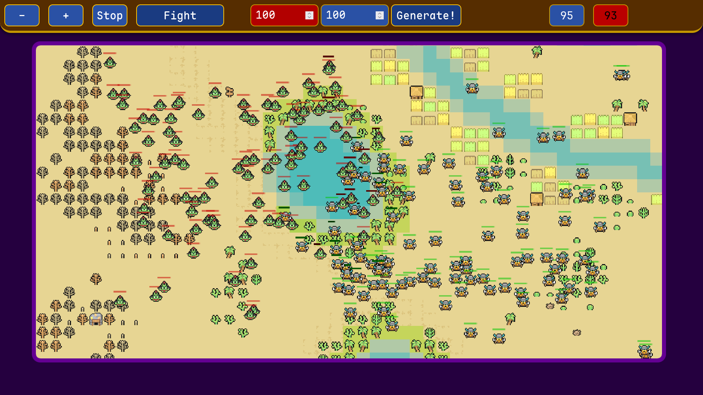
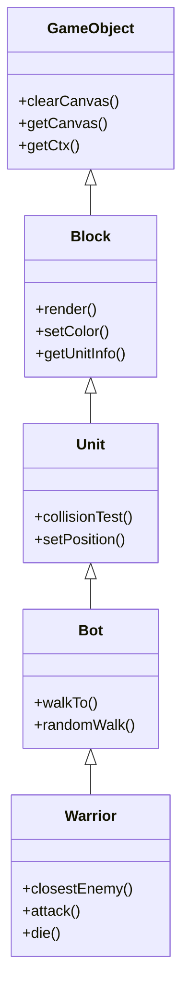
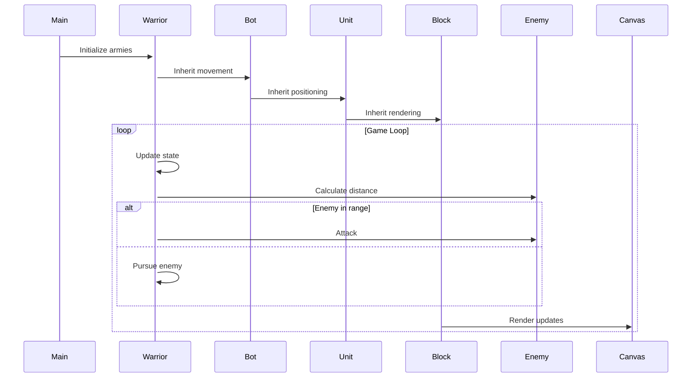

# Army Battle Simulation - Project Documentation & Showcase




PREVIEW in web the game: https://rts-game-hazel.vercel.app/

*Concept visualization of opposing armies clashing on a desert battlefield*

# The AI like Chatgpt and etc been only used to geenrate a README.md file (The description of the project),
# The game itself is hand written, the logic, design and etc. 

## Overview
A real-time 2D battle simulator showcasing autonomous warriors from opposing armies (Blue vs Red) with strategic combat behaviors. Built with TypeScript and Canvas API, this project demonstrates:

- Object-oriented game architecture
- Autonomous agent behaviors
- Real-time combat mechanics
- Dynamic UI updates
- Interactive canvas rendering

**Core Concept**: Two AI-controlled armies (5v5) engage in dynamic combat where warriors autonomously seek targets, engage in melee combat, and respond to battlefield conditions, while players can influence unit behavior through click commands.

## Key Features

### 1. Intelligent Warrior Behavior
- **Target Acquisition**: Units automatically detect and pursue nearest enemies
- **Combat System**: 
  - HP-based damage calculations
  - Armor damage reduction
  - Visual health indicators
  - Death animations/cleanup
- **Movement Modes**:
  - Random patrol (`randomWalk()`)
  - Aggressive pursuit (`closestEnemy()`)
  - Frenzied movement (`berserk()`)

### 2. Technical Components
#### Core Classes:


#### System Flow:


### 3. Immersive Features
- **Audio Integration**: 
  - Ambient desert sounds
  - Footstep SFX during movement
- **Responsive Canvas**: 
  - Window resize handling
  - Smooth scrolling initialization
- **Real-time UI**: 
  - Army counters (Heroes vs Orcs)
  - Color-based health indicators

## Technical Highlights

### Core Mechanics
```ts
// Warrior combat logic
public closestEnemy() {
  this.die(); // Check vitality
  this.findEnemies(); // Update target list
  
  if (this.canAttack()) {
    this.attack(); // Melee engagement
  } else {
    this.pursueTarget(); // Pathfinding
  }
}
```

### Rendering Pipeline
```ts
// Block rendering with health overlay
public render(image: HTMLImageElement, liveMeter: number): void {
  ctx.fillStyle = this.color;
  ctx.fillRect(/* health bar */);
  ctx.drawImage(/* unit sprite */);
}
```

### AI Decision Making
```ts
// Target prioritization logic
const odlegloscWrogow = enemies.map(enemy => ({
  distance: calculateDistance(this.position, enemy.position),
  id: enemy.id
}));

const nearestEnemy = odlegloscWrogow.reduce(
  (closest, current) => current.distance < closest.distance ? current : closest
);
```

## Project Structure
```
/src
├── main.ts                 # Core initialization
├── Components
│   ├── GameObject
│   │   ├── Unit.ts        # Base unit logic
│   │   ├── Warrior.ts     # Combat implementations
│   │   └── Bot.ts         # Movement strategies
│   └── Functions
│       ├── GenWarriors.ts # Army generator
│       └── ClickHandlers.ts
├── Types
│   └── PropsTypes         # Type definitions
└── style.scss             # UI styling
```

## Setup & Usage
1. **Install Dependencies**:
   ```bash
   npm i
   ```

2. **Development Build**:
   ```bash
   npm run dev
   ```

3. **Production Build**:
   ```bash
   npm run build
   ```

4. **Interaction**:
   - Click canvas to toggle unit behavior modes
   - Observe real-time army counters
   - Watch color changes indicating unit health

## Future Roadmap
- [ ] Add projectile combat system
- [ ] Implement formation controls
- [ ] Introduce terrain obstacles
- [ ] Create skill tree system
- [ ] Add multiplayer support
